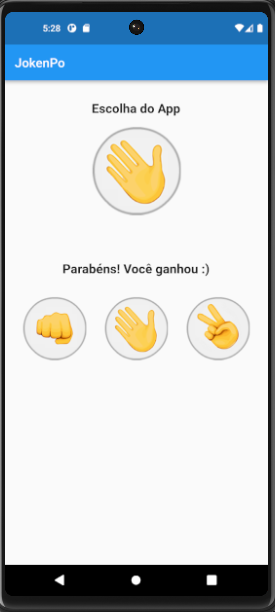

<h4 align="center"> 
	🚧 JokenPo 🚧
</h4>

	

 <a href="#-sobre-o-projeto">Sobre</a> •
 <a href="#-layout">Layout</a> • 
 <a href="#-como-executar-o-projeto">Como executar</a> • 
 <a href="#user-content--licença">Licença</a>

## 💻 Sobre o projeto

📄 Foi desenvolvido no curso Desenvolvimento Android e IOS com Flutter - Crie 15 Apps de Jamilton Damasceno.

⚪ O projeto consiste no jogo JokenPo: o usuário clica em uma das opções de jogada (pedra, papel ou tesoura) e o app escolhe aleatoriamente uma opção de jogada também. Dessa forma, ocorre a validação, de acordo com as normas do jogo, e retorna o vencedor da jogada.

---

## 🎨 Layout

### Emulador Android

  

---

### 📍 Como executar o projeto

Antes de começar, você vai precisar ter instalado em sua máquina a linguagem Dart e o framework Flutter.
Além disso, você também vai precisar ter configurado o emulador do Android Studio.

---

## 🛠 Tecnologias

As seguintes ferramentas foram usadas na construção do projeto:

-   **[Dart](https://dart.dev)**
-   **[Flutter](https://flutter.dev)**

---

## 📝 Licença

Feito por Danilo Taveira 👋🏽 [Entre em contato!](https://www.linkedin.com/in/danilo-taveira/)
